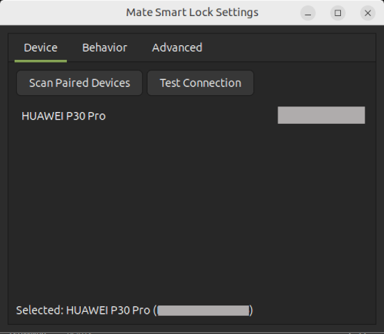
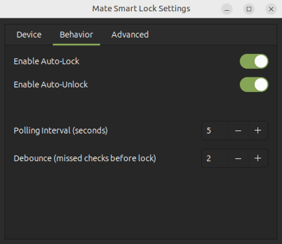
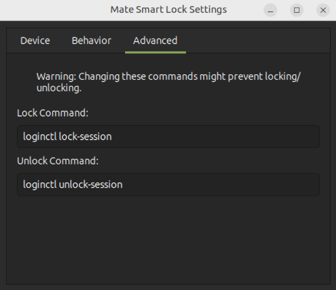

# Mate Smart Lock

**Automatically lock and unlock your Linux session based on Bluetooth proximity.**

Mate Smart Lock monitors a paired Bluetooth device (typically your smartphone). When the device goes out of range, the screen locks. When it comes back, the screen unlocks. No cloud, no background service, no heavy daemon — just a lightweight GTK3 tray app built on standard Linux tools.

> A modern, maintained replacement for [BlueProximity](https://sourceforge.net/projects/blueproximity/). — [Project page](https://ismailnasry.it/project/mate-smart-lock/)

---

## Features

- **Auto-Lock** — locks the session via `loginctl lock-session` when your device disconnects
- **Auto-Unlock** — unlocks when your device reconnects (requires polkit configuration; see below)
- **Configurable Grace Period** — debounce limit prevents false locks from brief signal drops
- **Configurable Polling Interval** — set how often Bluetooth status is checked (default: 5 s)
- **System Tray Icon** — AppIndicator3 tray with quick access to settings and manual lock/unlock
- **Custom Commands** — override the default lock/unlock commands in the Advanced tab
- **Minimal Dependencies** — uses `bluetoothctl` (BlueZ) and `python3-gi`; no external services

---

## Quick Install

```bash
curl -fsSL https://github.com/s7ntech82/Mate-Smart-Lock/releases/latest/download/install.sh | sudo bash
```

The script detects whether Snap is available and prefers it; otherwise installs the `.deb` package.

---

## Manual Install

### Option A — Snap (recommended)

```bash
sudo snap install mate-smart-lock
```

### Option B — Debian/Ubuntu (.deb)

```bash
sudo dpkg -i mate-smart-lock_0.1.0_all.deb
sudo apt-get install -f   # resolve any missing dependencies
```

**Dependencies installed automatically by the .deb:**
- `python3`, `python3-gi`, `gir1.2-gtk-3.0`, `bluez`
- Recommended: `gir1.2-appindicator3-0.1` or `gir1.2-ayatanaappindicator3-0.1`

---

## Uninstall

```bash
curl -fsSL https://github.com/s7ntech82/Mate-Smart-Lock/releases/latest/download/uninstall.sh | sudo bash
```

Or manually:

```bash
# Snap
sudo snap remove mate-smart-lock

# Deb
sudo apt-get remove mate-smart-lock
```

User configuration at `~/.config/mate-smart-lock/` is **not** removed automatically.

---

## Usage

Launch from your applications menu or run:

```bash
mate-smart-lock
```

A tray icon appears. Right-click → **Settings** to configure.

1. **Device tab** — click "Scan Paired Devices" and select your phone
2. **Behavior tab** — enable "Auto-Lock" (and optionally "Auto-Unlock")
3. Close settings — the app runs in the background monitoring proximity

---

## Auto-Unlock Setup

Auto-unlock requires a polkit rule that allows `loginctl unlock-session` without a password prompt. Create `/etc/polkit-1/localauthority/50-local.d/mate-smart-lock.pkla`:

```ini
[Allow unlock-session]
Identity=unix-user:YOUR_USERNAME
Action=org.freedesktop.login1.unlock-session
ResultActive=yes
ResultInactive=yes
ResultAny=yes
```

Replace `s7ntech82`(original is s7ntech) with your actual username.

---

## Demo

| Device | Behavior | Advanced |
|--------|----------|----------|
|  |  |  |

---

## Security & Privacy

- **Bluetooth only** — the app polls `bluetoothctl` locally; no network requests are made
- **No telemetry** — zero data is sent anywhere
- **Screen lock** — uses the system `loginctl` session manager (or your custom command)
- **Config storage** — settings are saved locally at `~/.config/mate-smart-lock/config.json`
- **Permissions (Snap)** — requires `bluez` (Bluetooth) and `login-session-control` interfaces; both are declared in the snap manifest and must be granted by the user

---

## Requirements

| Component | Requirement |
|-----------|-------------|
| OS | Ubuntu / Debian-based Linux |
| Python | 3.8+ |
| Bluetooth | BlueZ (`bluetoothctl`) |
| Display | X11 or Wayland with GTK3 support |
| Session | systemd-logind (`loginctl`) |

---

## License

[MIT](LICENSE) — © Ismail Nasry
